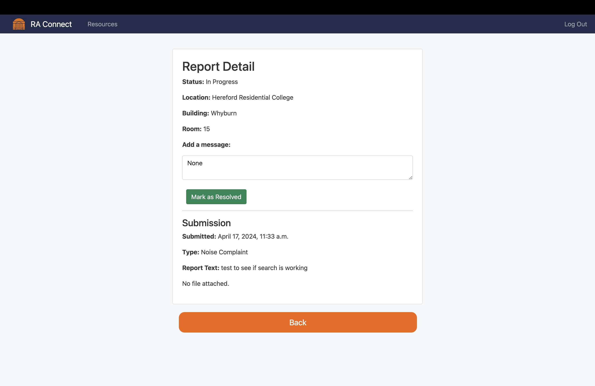

# RA.Connect

RA.Connect is a web application designed to streamline University of Virginia dorm residents to their resident advisors (RAs). The project was a semester-long group [assignment](https://s24.cs3240.org/project.html#project-overview) for CS 3240 (Advanced Software Development Techniques) and should **not** be used for serious reports.


## Online Usage

The web app can be directly accessed and tested through our [Heroku](https://b-30-a1951ad3d5cd.herokuapp.com/) deployment.

## Local Installation

If your usage is only local, use the package manager [pip](https://pip.pypa.io/en/stable/) to install the dependencies listed on the provided requirements.txt file.

```bash
pip install -r requirements.txt
```

Furthermore, the following inputs should be made in the root directory to make sure the local databse is properly configured:

```bash
python manage.py makemigrations
python manage.py migrate
```

## Local Usage

After installation, run the following commands to start the web app:

```bash
python manage.py runserver
```

and access it through the link [http://127.0.0.1:8000/](http://127.0.0.1:8000/).

## Contributions

The group members were divided into the following roles, the responsibilites of which can be viewed on the project details [page](https://s24.cs3240.org/project.html#team-roles):

- Price Mckinney, Scrum Master (wpm7hs)
- Yanson Khuu, DevOps Manager (fbx2jt)
- Kaitlyn Kreth, Requirements Manager (qte7kg)
- Megan Lewis, Testing Manager (nxk7tq)
- Hugo Abbot, Software Architect (drt3sm)

  ## Screenshots

### Anonymous Reporting

<div style="display: flex; flex-wrap: wrap; gap: 10px;">
    
    
    
    
</div>

### Admin View
<div style="display: flex; flex-wrap: wrap; gap: 10px;">
     
    
     
    
    
    
</div>

### Common User View

<div style="display: flex; flex-wrap: wrap; gap: 10px;">
    
    
    
</div>

## License

[MIT](https://choosealicense.com/licenses/mit/)

